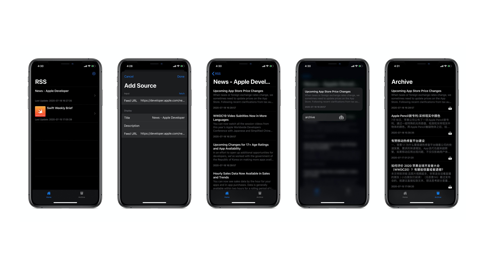

# RSSSwiftUI

RSSSwiftUI is a client RSS reader that is built with SwiftUI and CoreData. now it's very simple.

## Previews

## Requirement

- Swift 5.0
- iOS 13.0+

## TODO

- [ ] Batch Import RSS sources
- [ ] CoreData & iCloud AutoSync
- [ ] CloudKit Support
- [ ] PadOS & MacOS Support

## Thanks

This application makes use of the third party library [FeedKit](https://github.com/nmdias/FeedKit), and this repository [ShoB](https://github.com/iDara09/ShoB) was inspired to me, THANKS!

## End

If you found a bug, open an [issue](https://github.com/acumen1005/rss/issues), or contact me nsacumen@gmail.com. 
